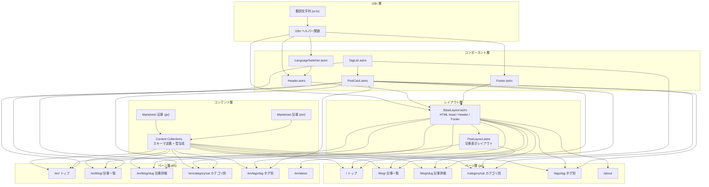

# デザインドキュメント

## 概要

Astro v5.x + TypeScript (strict) で構築する個人技術ブログ。Content Collections による型安全な記事管理、日本語/英語の多言語対応、HackTheBox 風ダークサイバーテーマを特徴とする静的サイト。

主な設計方針:
- Astro のファイルベースルーティングと Content Collections を最大限活用
- CSS Variables による一貫したダークテーマ管理
- 言語別ディレクトリ構造 + slug ベースの記事対応付けによる i18n
- SSG（静的サイト生成）による高速配信

## アーキテクチャ



## コンポーネントとインターフェース

### Content Collections スキーマ (`src/content.config.ts`)

Astro v5 の Content Collections API を使用して記事スキーマを定義する。

```typescript
import { defineCollection, z } from 'astro:content';
import { glob } from 'astro/loaders';

const blog = defineCollection({
  loader: glob({ pattern: "**/*.md", base: "./src/content/blog" }),
  schema: z.object({
    title: z.string(),
    description: z.string(),
    pubDate: z.coerce.date(),
    category: z.enum(['htb', 'lang', 'misc']),
    tags: z.array(z.string()),
    difficulty: z.string().optional(),
    draft: z.boolean().default(false),
  }),
});

export const collections = { blog };
```

記事ファイルは `src/content/blog/ja/` と `src/content/blog/en/` に配置する。Astro v5 の glob loader により、ファイルパスから言語と slug を抽出する。記事の id は `ja/slug` や `en/slug` の形式となる。

### i18n ユーティリティ (`src/i18n/`)

#### 翻訳文字列 (`src/i18n/ui.ts`)

```typescript
export const languages = {
  ja: '日本語',
  en: 'English',
} as const;

export const defaultLang = 'ja' as const;

export type Lang = keyof typeof languages;

export const ui: Record<Lang, Record<string, string>> = {
  ja: {
    'nav.home': 'ホーム',
    'nav.blog': 'ブログ',
    'nav.about': 'About',
    'category.htb': 'HackTheBox Writeups',
    'category.lang': '言語探求',
    'category.misc': 'その他',
    'post.publishedAt': '公開日',
    'post.category': 'カテゴリ',
    'post.tags': 'タグ',
    'post.allPosts': '全記事一覧',
    'post.latestPosts': '最新記事',
  },
  en: {
    'nav.home': 'Home',
    'nav.blog': 'Blog',
    'nav.about': 'About',
    'category.htb': 'HackTheBox Writeups',
    'category.lang': 'Language Exploration',
    'category.misc': 'Misc',
    'post.publishedAt': 'Published',
    'post.category': 'Category',
    'post.tags': 'Tags',
    'post.allPosts': 'All Posts',
    'post.latestPosts': 'Latest Posts',
  },
};
```

#### ヘルパー関数 (`src/i18n/utils.ts`)

```typescript
import { defaultLang, ui, type Lang } from './ui';

/** 現在の言語を取得（URL パスから判定） */
export function getLangFromUrl(url: URL): Lang {
  const [, lang] = url.pathname.split('/');
  if (lang === 'en') return 'en';
  return defaultLang;
}

/** 翻訳文字列を取得 */
export function useTranslations(lang: Lang) {
  return function t(key: string): string {
    return ui[lang][key] || ui[defaultLang][key] || key;
  };
}

/** 言語に応じたパスプレフィックスを返す */
export function getPathPrefix(lang: Lang): string {
  return lang === defaultLang ? '' : `/${lang}`;
}

/** 記事コレクションから指定言語の記事を取得するためのフィルタ */
export function filterPostsByLang(posts: Array<{ id: string; data: { draft: boolean } }>, lang: Lang) {
  return posts.filter(
    (post) => post.id.startsWith(`${lang}/`) && !post.data.draft
  );
}

/** 記事 id から slug を抽出（言語プレフィックスを除去） */
export function getSlugFromId(id: string): string {
  // id は "ja/slug" or "en/slug" の形式
  const parts = id.split('/');
  return parts.slice(1).join('/');
}

/** 対応する他言語ページの URL を生成 */
export function getAlternateUrl(currentUrl: URL, targetLang: Lang): string {
  const currentLang = getLangFromUrl(currentUrl);
  const pathname = currentUrl.pathname;

  if (currentLang === 'en') {
    // /en/... → /...
    const jaPath = pathname.replace(/^\/en/, '') || '/';
    return targetLang === 'ja' ? jaPath : pathname;
  } else {
    // /... → /en/...
    return targetLang === 'en' ? `/en${pathname}` : pathname;
  }
}
```

### レイアウトコンポーネント

#### BaseLayout.astro

Props:
- `title: string` — ページタイトル
- `description: string` — メタ description
- `lang: Lang` — 現在の言語（デフォルト: `'ja'`）
- `canonicalUrl?: string` — canonical URL
- `alternateUrl?: string` — 他言語ページの URL

責務:
- HTML head（charset, viewport, title, meta description, OGP, hreflang, canonical, フォント読み込み, global.css）
- Header コンポーネントの配置
- `<main>` スロット
- Footer コンポーネントの配置

#### PostLayout.astro

Props:
- `title: string`
- `description: string`
- `pubDate: Date`
- `category: string`
- `tags: string[]`
- `lang: Lang`
- `difficulty?: string`

責務:
- BaseLayout を継承
- 記事ヘッダー（タイトル、公開日、カテゴリ、difficulty（HTB の場合）、タグ）
- 記事本文スロット

### UI コンポーネント

#### Header.astro

Props:
- `lang: Lang`

表示要素:
- サイトタイトル（トップページへのリンク）
- ナビゲーション: ホーム、ブログ、About
- LanguageSwitcher

#### Footer.astro

Props:
- `lang: Lang`

表示要素:
- コピーライト表示

#### LanguageSwitcher.astro

Props:
- `lang: Lang`

動作:
- 現在の言語を表示
- クリックで対応する他言語ページへ遷移
- 対応する記事が存在しない場合はその言語のトップページへ遷移

#### PostCard.astro

Props:
- `title: string`
- `description: string`
- `pubDate: Date`
- `category: string`
- `tags: string[]`
- `url: string`
- `lang: Lang`

表示要素:
- 記事タイトル（リンク）
- 公開日
- カテゴリバッジ
- 概要テキスト
- タグ一覧

#### TagList.astro

Props:
- `tags: string[]`
- `lang: Lang`

表示要素:
- タグのリスト（各タグはタグ別一覧ページへのリンク）

## データモデル

### 記事 (Post)

```typescript
interface Post {
  id: string;           // "ja/htb-example" or "en/htb-example"
  data: {
    title: string;
    description: string;
    pubDate: Date;
    category: 'htb' | 'lang' | 'misc';
    tags: string[];
    difficulty?: string;  // HTB 記事専用
    draft: boolean;
  };
  body: string;          // Markdown 本文
  rendered: {            // レンダリング済み HTML
    html: string;
  };
}
```

### 言語設定

```typescript
type Lang = 'ja' | 'en';

interface LanguageConfig {
  languages: Record<Lang, string>;  // { ja: '日本語', en: 'English' }
  defaultLang: Lang;                // 'ja'
}
```

### サイト設定

```typescript
interface SiteConfig {
  title: string;
  description: string;
  url: string;
  author: string;
}
```

### CSS Variables 構造

```css
:root {
  /* カラー */
  --color-base: #0a0e17;
  --color-accent: #9fef00;
  --color-secondary: #a4b1cd;
  --color-surface: #141924;
  --color-border: #1e2a3a;
  --color-text: #e2e8f0;
  --color-text-muted: #64748b;

  /* フォント */
  --font-body: 'Inter', sans-serif;
  --font-code: 'JetBrains Mono', monospace;

  /* スペーシング */
  --space-xs: 0.25rem;
  --space-sm: 0.5rem;
  --space-md: 1rem;
  --space-lg: 2rem;
  --space-xl: 4rem;

  /* レイアウト */
  --max-width: 48rem;
}
```


## 正当性プロパティ (Correctness Properties)

*プロパティとは、システムの全ての有効な実行において成り立つべき特性や振る舞いのことである。人間が読める仕様と機械的に検証可能な正当性保証の橋渡しとなる形式的な記述である。*

### Property 1: Frontmatter スキーマバリデーション

*任意の* Frontmatter データに対して、category が "htb" | "lang" | "misc" のいずれかであり、title が非空文字列、pubDate が有効な日付、tags が文字列配列である場合、スキーマバリデーションは成功する。category がこれら3値以外の場合、バリデーションは失敗する。

**Validates: Requirements 1.1**

### Property 2: slug 抽出の一貫性

*任意の* 有効な slug 文字列に対して、`getSlugFromId("ja/" + slug)` と `getSlugFromId("en/" + slug)` は同一の値を返す。

**Validates: Requirements 1.4**

### Property 3: draft 記事のフィルタリング

*任意の* 記事リスト（draft が true と false の混在）に対して、`filterPostsByLang` の結果には draft が true の記事が含まれない。

**Validates: Requirements 1.5**

### Property 4: URL からの言語判定

*任意の* URL パスに対して、パスが `/en/` で始まる場合 `getLangFromUrl` は `'en'` を返し、それ以外の場合は `'ja'` を返す。

**Validates: Requirements 2.1, 2.2**

### Property 5: 翻訳キーの完全性

*任意の* 翻訳キーに対して、日本語 (`ja`) の翻訳辞書にそのキーが存在するならば、英語 (`en`) の翻訳辞書にも同じキーが存在する（逆も同様）。

**Validates: Requirements 2.3**

### Property 6: 言語切り替え URL の往復一貫性

*任意の* 有効な URL に対して、日本語→英語→日本語と言語切り替えを行った場合、元の URL に戻る（ラウンドトリッププロパティ）。

**Validates: Requirements 2.4, 6.3**

### Property 7: 記事の pubDate 降順ソート

*任意の* 公開記事リストに対して、pubDate でソートした結果は、リスト内の全ての隣接ペア (i, i+1) において `posts[i].pubDate >= posts[i+1].pubDate` を満たす。

**Validates: Requirements 3.3, 3.4**

### Property 8: カテゴリフィルタリング

*任意の* 記事リストと *任意の* カテゴリ値に対して、カテゴリフィルタの結果に含まれる全ての記事は指定されたカテゴリに属する。

**Validates: Requirements 3.5**

### Property 9: タグフィルタリング

*任意の* 記事リストと *任意の* タグ値に対して、タグフィルタの結果に含まれる全ての記事は指定されたタグを tags 配列に含む。

**Validates: Requirements 3.6**

## エラーハンドリング

### コンテンツバリデーションエラー

- Frontmatter が Valibot スキーマに適合しない場合、Astro のビルド時にエラーメッセージを表示してビルドを中断する（Astro 標準動作）
- category に無効な値が指定された場合、Valibot の picklist バリデーションがエラーを報告する

### ルーティングエラー

- 存在しない slug へのアクセスは Astro の 404 ページで処理する
- 存在しないカテゴリ・タグへのアクセスは空の記事一覧を表示する

### i18n エラー

- 翻訳キーが見つからない場合、`useTranslations` はデフォルト言語（日本語）のキーにフォールバックし、それも見つからない場合はキー文字列をそのまま返す
- 対応する他言語記事が存在しない場合、Language_Switcher はその言語のトップページへ遷移する

## テスト戦略

### テストフレームワーク

- ユニットテスト: Vitest
- プロパティベーステスト: fast-check（Vitest と統合）
- パッケージマネージャー: bun または pnpm

### テスト対象

プロパティベーステストとユニットテストの二層構造で検証する。

#### プロパティベーステスト

各プロパティテストは最低 100 回のイテレーションで実行する。各テストにはデザインドキュメントのプロパティ番号を参照するコメントを付与する。

タグフォーマット: **Feature: astro-blog, Property {number}: {property_text}**

テスト対象関数:
- `getSlugFromId` — Property 2
- `filterPostsByLang` — Property 3
- `getLangFromUrl` — Property 4
- `useTranslations` — Property 5（翻訳キーの完全性）
- `getAlternateUrl` — Property 6
- ソートロジック — Property 7
- カテゴリフィルタ — Property 8
- タグフィルタ — Property 9

Frontmatter スキーマバリデーション（Property 1）は Valibot スキーマを直接テストする。

#### ユニットテスト

- 各 i18n ヘルパー関数の具体的な入出力例
- エッジケース: 空の記事リスト、タグなしの記事、ルートパス `/` の言語判定
- エラーケース: 存在しない翻訳キーのフォールバック動作

#### テスト対象外

- Astro コンポーネントのレンダリング（`.astro` ファイルは Astro ビルドプロセスに依存）
- CSS スタイリング
- デプロイ設定
